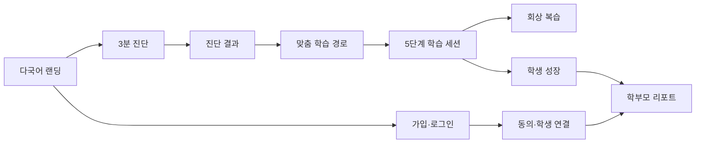

# 수학착착 화면 설계 v1.0

## 1. Goal Framing

- 학생: 지금 해야 할 한 가지 행동과 다음 학습 단계를 쉽게 이해한다.
- 학부모: 점수 경쟁보다 성장 변화, 어려움, 다음 권장 행동을 확인한다.
- 운영자: 번역·콘텐츠·배포 상태를 높은 정보 밀도로 관리한다.

## 2. Specification Engineering

완료 상태는 8개 지원 언어에서 랜딩→진단→학습→복습→성장 리포트의 핵심 화면 구조가 정의되고, 동일 컴포넌트·토큰·승인 캐릭터를 사용하며, 320px부터 데스크톱까지 내용 손실 없이 동작하는 것이다.

## 3. 화면 지도

## 4. 핵심 화면 명세

| ID | 화면 | 주 행동 | 필수 상태 |
|---|---|---|---|
| SCR-001 | 랜딩 | 무료 진단 시작 | 기본, locale 변경, 번역 fallback |
| SCR-002 | 가입·로그인 | 4개 역할 선택 후 Google·Naver·Kakao 인증 | 공급자 준비/미준비, OAuth 진행·취소·만료·변조, 온보딩 필요, 보호자·학원 검증 대기, 활성 세션, 로그아웃 |
| SCR-003 | 진단 | 한 문제씩 응답 | 로딩, 응답, 저장 실패, 완료 |
| SCR-004 | 진단 결과 | 추천 경로 시작 | 요약, 근거, 보호자 설명 |
| SCR-005 | 학습 홈 | 오늘 단계 시작/재개 | 신규, 진행 중, 완료, offline |
| SCR-006 | 학습 세션 | 풀이·힌트·설명 | 입력, 힌트 0~3, 재시도, 정답 |
| SCR-007 | 복습 | 기한 회상 수행 | 없음, 예정, 기한 도래, 완료 |
| SCR-008 | 학생 성장 | 성장·다음 목표 확인 | 주간, 월간, 데이터 부족 |
| SCR-009 | 학부모 리포트 | 성장 요약 확인 | 연결 전, 동의 필요, 활성, 해제 |
| SCR-010 | 설정 | 언어·시간대·동작 축소 | 저장, 오류, 재인증 |

## 5. 정보 밀도와 레이블

- 학생 화면은 한 화면 한 주 행동, 보조 행동 최대 2개를 원칙으로 한다.
- 버튼은 동사로 시작하고 번역 확장 40%를 허용한다.
- 점수만 강조하지 않고 변화 이유와 다음 행동을 함께 표시한다.
- 오류는 내부 코드 대신 복구 가능한 행동을 제공하며 코드 자체는 진단 정보로 분리한다.
- 중국어·일본어 줄바꿈과 유럽 언어의 긴 단어를 고려해 고정 높이를 사용하지 않는다.

## 6. 반응형·접근성

- 320~599px: 단일 열, 하단 주 행동, 캐릭터는 콘텐츠를 가리지 않는다.
- 600~1023px: 2열 가능, 읽기 순서는 DOM 순서를 유지한다.
- 1024px 이상: 랜딩 hero와 학습 요약에서 2열을 사용한다.
- 최소 터치 영역 44px, 본문 16px, 명확한 focus ring을 사용한다.
- `prefers-reduced-motion`에서는 장식 이동과 캐릭터 잔동작을 제거한다.

## 7. 캐릭터 사용

- 승인된 16개 2D 포즈만 사용한다.
- 착착이는 친근한 안내·재도전을, 공식이는 개념·근거·성장 설명을 담당한다.
- 캐릭터는 답을 대신 말하지 않으며 학습 콘텐츠보다 시각적 우선순위가 높아지지 않는다.
- Gate 5 승인 전에는 AI 자동 행동을 제품 mock 기본 동작에 연결하지 않는다.

## 8. 검증·종료

8개 locale의 키 대칭, 접근성 기본 구조, 반응형 CSS, 승인 자산 경로를 자동 검사한다. 이후 브라우저에서 한국어·영어·중국어와 390px/1440px 뷰포트를 수동 확인한다. 자동·수동 검토가 통과하면 Phase 5를 종료한다.
