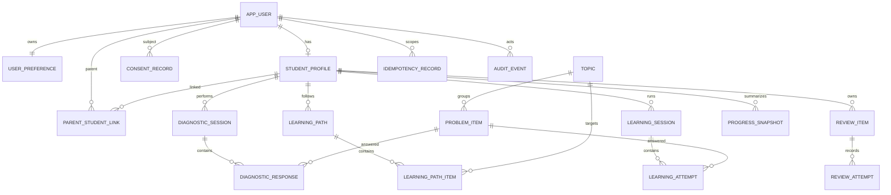

# 수학착착 데이터베이스 설계 v1.0

## Phase 43 PostgreSQL 0029

Scan attestation 계약과 통제별 요건을 append-only로 저장한다. 결과·attestation·조정·release 근거는 NULL이며 입력·검증·조정·release 권한은 false다.

## Phase 42 PostgreSQL 0028

`0028_external_reference_proof_scanner_readiness_contract.sql`은 스캐너 준비 계약과 통제별 요건 테이블을 추가한다. 승인된 엔진 목록은 빈 JSON 배열로 고정하고 scanner·signature DB·object·result·attestation 참조와 실행 수치는 NULL로 강제한다. object read·scan·retry·failover·attestation·release 권한은 false이며 두 테이블의 UPDATE·DELETE는 append-only trigger로 거부한다. rollback은 두 테이블과 전용 trigger function만 제거한다.

## 1. Goal Framing

- 사용자: 학생, 연결된 학부모, 교육 콘텐츠 운영자, 개인정보·서비스 운영 책임자
- 변화: 진단부터 학습·힌트·복습·성장 리포트까지 데이터가 한 학생의 권한 경계 안에서 일관되게 이어진다.

## 2. Specification Engineering

완료 상태는 P0 API가 필요로 하는 18개 테이블, 관계·무결성·인덱스·보존 정책, 정방향/역방향 마이그레이션이 명시되고 정적 검증을 통과한 상태다. 운영 DB 실행은 스테이징 자격증명과 백업이 준비된 뒤 별도 수행한다.

## 3. Context Engineering

- DB: PostgreSQL
- 스키마: `mathchakchak`
- ID: 애플리케이션이 생성한 UUID
- 시간: DB에는 `timestamptz` UTC 의미로 저장하고 화면에서 사용자 시간대로 변환
- 다국어: 사용자 선호 locale과 세션 당시 locale만 저장하며 문제·UI 번역 본문은 버전 관리 콘텐츠 계층에서 제공
- 관련 계약: API, 기능, 이벤트, 개인정보, 로케일 계약

## 4. 논리 모델

## 5. 권한과 개인정보

| 데이터 | 학생 | 연결 학부모 | 서비스/운영 |
|---|---|---|---|
| 학생 프로필·설정 | 본인 읽기·수정 | 허용된 요약 읽기 | 최소 권한 |
| 진단·학습 세션 | 본인 생성·읽기 | 상태·요약 읽기 | 처리 서비스 |
| 응답 원자료 | 본인 제출 | 직접 열람 금지 | 채점 서비스 |
| 성장 스냅샷 | 본인 읽기 | 유효한 연결·동의 시 읽기 | 리포트 서비스 |
| 동의 기록 | 주체·보호자 | 관련 기록 | 개인정보 담당 |
| 감사·중복방지 | 직접 접근 없음 | 직접 접근 없음 | 전용 서비스 |

- API는 매 요청에서 역할, 학생 소유권, 활성 학부모 연결, 동의를 검증한다.
- 운영 연결 계정은 테이블 소유자와 분리하며 최소 권한을 적용한다.
- 답안 원문과 문제 원문은 관측 이벤트·감사 metadata에 넣지 않는다.
- 비밀번호·토큰·외부 연락처 원문은 이 스키마에 저장하지 않는다.
- 계정 삭제는 인증 주체를 비활성화하고 법적 보존 대상 이외 학습 데이터를 30일 이내 삭제·비식별화하는 작업으로 처리한다.

## 6. 무결성·동시성

- 세션 완료 상태에는 `completed_at`이 필수다.
- 한 세션의 시도 순번은 유일하다.
- 한 사용자·기능 범위의 `Idempotency-Key`는 유일하며 24시간 후 청소한다.
- 복습 시각은 `timestamptz`로 비교하고 표시만 사용자 시간대로 변환한다.
- 진단 완료→학습 경로 생성, 답안 저장→복습 일정 갱신은 각각 하나의 트랜잭션으로 묶는다.
- 콘텐츠 항목은 학습 기록에서 참조 중이면 물리 삭제하지 않고 `active=false`로 보존한다.

## 7. 인덱스

- 학생별 최근 진단·학습 세션
- 세션별 시도 순서
- 학생별 기한 도래 복습 항목 partial index
- 학생별 최신 성장 스냅샷
- 만료 중복방지 키와 최신 감사 이벤트

## 8. 마이그레이션·복구

1. 스테이징 백업과 복구 가능성을 확인한다.
2. `0001_initial.sql`을 단일 트랜잭션으로 적용한다.
3. 구조·제약·핵심 API smoke test를 실행한다.
4. 실패하면 트랜잭션을 중단한다. 적용 후 되돌림이 필요하면 백업 확인 후 `0001_rollback.sql`을 사용한다.
5. 운영에는 동일 해시의 검증된 migration만 적용한다.

Phase 26의 `0012_data_rights.sql`은 권리 요청과 append-only 상태 이력을 추가한다. 요청자·정보주체·학생 프로필 FK는 `ON DELETE RESTRICT`로 두어 이행 전 요청 증적이 연쇄 삭제되지 않게 하며, `0012_data_rights_rollback.sql`로 로컬 전진→롤백→재적용을 검증한다.

Phase 27의 `0013_privacy_operations.sql`은 요청 배정·증적 해시·승인/반려 결정을 분리 저장한다. 운영 FK는 `ON DELETE RESTRICT`, 상태 전이는 요청 행 잠금과 단일 트랜잭션을 사용하며 실제 이행 전에는 완료 상태를 생성하지 않는다.

Phase 28의 `0014_fulfilment_controls.sql`은 운영 역할·dry-run 계획·영향 평가·법적 보류·이중 승인을 추가한다. 계획은 요청당 하나, 활성 보류는 요청당 하나이며 계획별 승인 역할과 승인자는 각각 UNIQUE다. 모든 FK는 운영 증적 보존을 위해 `ON DELETE RESTRICT`를 사용한다.

Phase 29의 `0015_fulfilment_package_manifest.sql`은 불변 이행 매니페스트와 무변경 복구 체크포인트를 추가한다. 매니페스트는 계획별 증가 리비전과 단일 선행·후속 관계를 가지며 SHA-256으로 영향·승인·유효기간을 결합한다. 두 테이블의 `BEFORE UPDATE OR DELETE` 트리거는 변경을 거부하고 재검증은 새 행만 추가한다.

Phase 30의 `0016_execution_readiness.sql`은 준비도 검토 리비전과 외부 필수 조건 6종을 추가한다. 검토는 `BLOCKED_LOCAL_PREREQUISITE` 또는 `BLOCKED_EXTERNAL`만 허용하고 중단 스위치 true·실행 승인 false를 CHECK로 강제한다. 검토와 조건은 UPDATE·DELETE 트리거로 변경할 수 없으며 재평가는 새 리비전으로만 남긴다.

Phase 31의 `0017_execution_handoff_packet.sql`은 외부 운영 증거 인계 패킷과 조건별 요구사항을 추가한다. 여섯 조건마다 책임 역할, 필수 증거 2종, 개인정보·보안 이중 검토 역할, 제출 경로 정책을 저장한다. 실제 제출 값은 NULL, 경로는 `MISSING_EXTERNAL`, 실행 승인은 false로 고정하며 두 테이블 모두 UPDATE·DELETE를 거부한다.

Phase 32의 `0018_external_evidence_validation_contract.sql`은 외부 증거 검증 정책과 조건별 규칙을 추가한다. 상태 8종·전이 13종, 최소 메타데이터 6종, 금지 필드 7종, 서로 다른 개인정보·보안 검토자, 만료·철회 확인을 정의한다. 실제 증거와 최대 유효기간은 저장하지 않고 정책·규칙 UPDATE·DELETE를 거부한다.

Phase 33의 `0019_external_evidence_intake_adapter_contract.sql`은 외부 증거 수신 어댑터 계약과 통제별 포트를 추가한다. 여섯 포트 모두 endpoint와 transport identity를 NULL, 연결을 false로 강제하고 mTLS·서명·발급자 신뢰·replay guard·격리·이중 승인 재처리를 필수로 선언한다. 외부 정책이 없는 서명 알고리즘·신뢰목록·replay window·격리·retry·dead-letter 경로는 `MISSING_EXTERNAL`로 유지하며 원문 저장과 자동 해제를 금지한다. 두 테이블은 UPDATE·DELETE를 거부한다.

Phase 34의 `0020_external_connection_acceptance_packet.sql`은 사전 연결 수락 패킷과 요구사항을 추가한다. 인증서 수명주기·신뢰 저장소·키 회전·접속 허가·실패 복구·운영 수락의 책임 역할 6개와 증적 12종을 정의하고, 증적 참조·해시·검증 시각은 NULL로 유지한다. 개인정보·보안 이중 승인과 외부 테스트를 요구하지만 테스트·결정은 미수행 상태이며 자격·비밀 저장, 연결 허용, 연결·실행 승인은 false로 강제한다. 두 테이블은 UPDATE·DELETE를 거부한다.

Phase 35의 `0021_external_configuration_evidence_queue_contract.sql`은 구성 증적 메타데이터 대기열 계약과 슬롯을 추가한다. 슬롯 6개는 증적 종류 12개를 참조하며 불변 참조·SHA-256·발급자 출처·중복 방지를 필수로 선언한다. 실제 참조·해시·submission ID·queue ID·제출 시각과 검토 TTL은 NULL이고 검증 상태는 `NOT_SUBMITTED`다. 원문·자격·비밀 저장과 자동 승격, 연결·실행 승인을 금지하며 두 테이블은 UPDATE·DELETE를 거부한다.

Phase 36의 `0022_external_evidence_submission_envelope_contract.sql`은 제출 envelope 정책 계약과 통제별 규칙을 추가한다. 규칙 6개는 필수 필드 10개, 참조 scheme 승인 4단계, UUID v4 submission ID, 슬롯 단위 멱등 범위와 거부 사유 10개를 정의한다. 허용 scheme은 빈 배열, 제출 상태는 `NOT_ACCEPTING`, 실제 제출 메타데이터와 멱등 보존기간은 NULL이다. 원문·자격·비밀 저장과 allowlist 활성화·자동 승격·연결·실행 승인을 금지하며 두 테이블은 UPDATE·DELETE를 거부한다.

Phase 37의 `0023_external_reference_scheme_governance_contract.sql`은 참조 scheme 거버넌스 계약과 통제별 정책을 추가한다. 정책 6개는 제안 필드 10개, 대상 제한 필드 6개, 생명주기 7개와 재승인 트리거 6개를 정의한다. 제안자·개인정보·보안 승인자 직무분리와 정확한 대상 범위를 요구하고 wildcard authority·무제한 path를 금지한다. 실제 scheme·대상·승인자·시각과 최대 유효기간은 NULL이며 allowlist·제출·자동 승격·연결·실행 승인은 false다. 두 테이블은 UPDATE·DELETE를 거부한다.

Phase 38의 `0024_external_reference_target_validation_contract.sql`은 외부 참조 대상 검증 계약과 통제별 규칙을 추가한다. 규칙 6개는 정규화 단계 8개, 거부 규칙 14개, 소유권 증명 유형 6개와 금지 주소 클래스 8개를 정의한다. strict single parse, IDNA ASCII, Unicode confusable 검사, 경로 탈출·인코딩 우회·userinfo·IP literal·wildcard 거부와 DNS 재바인딩·사설망 차단을 요구한다. 실제 대상·증명·DNS snapshot·검증 시각은 NULL이고 허용 포트는 빈 배열이며 redirect·DNS lookup·allowlist write·fetch·연결·실행은 false다. 두 테이블은 UPDATE·DELETE를 거부한다.

Phase 39의 `0025_external_reference_proof_handoff_contract.sql`은 소유권 증명·DNS 무결성 인계 계약과 통제별 요건을 추가한다. 요건 6개는 proof 필드 12개, issuer trust 8개, 생명주기 7개, 재검증 트리거 8개와 DNS snapshot 필드 8개를 정의한다. 메타데이터 전용·불변 참조·서명·만료·철회 확인과 issuer/reviewer 분리를 요구한다. 실제 proof·issuer·evidence·signature·DNS·시각과 TTL·SLA는 NULL이며 원문·자격·비밀 저장과 proof intake·DNS·철회 polling·allowlist·연결·실행은 false다. 두 테이블은 UPDATE·DELETE를 거부한다.

Phase 40의 `0026_external_reference_proof_intake_contract.sql`은 증명 intake 상태기계 계약과 통제별 규칙을 추가한다. 규칙 6개는 상태 9개, 전이 14개, 거절 코드 12개, replay 통제 6개와 검토 결정 3개를 정의한다. quarantine 선행, 중복·replay·서명·issuer 검사와 서로 다른 2인 검토를 요구한다. 실제 채널·proof·evidence·signature·issuer·nonce·검토자·결정·시각과 보존 기간·replay window·SLA는 NULL이며 submission·quarantine write·상태 전이·검증·검토·release·allowlist·연결·실행은 false다. 두 테이블은 UPDATE·DELETE를 거부한다.

Phase 41의 `0027_external_reference_proof_quarantine_readiness_contract.sql`은 격리 저장·콘텐츠 검사·보존·삭제·감사 운영 준비 계약과 통제별 요구사항을 추가한다. 요구사항 6개는 저장소 보안 8개, 검사 단계 8개, 거절 코드 12개, 보존 이벤트 7개, 감사 필드 10개를 정의한다. 허용 content type은 빈 배열이고 저장소·scanner·정책·object·scan·삭제 증명·시각과 크기·기간은 NULL이다. storage·inspection·scan·retention·deletion·audit·release·promotion은 false이며 두 테이블은 UPDATE·DELETE를 거부한다.

## 9. 검증 결과

- 자동 검증: 계약 JSON, 테이블/관계/제약/인덱스, 트랜잭션, rollback 대칭성, 금지 필드 PASS
- PostgreSQL 16 격리 실행: `0001_initial.sql` 적용 PASS
- smoke test: 18개 테이블, locale 허용 목록, idempotency 고유성, 감사 metadata 민감정보 차단 PASS
- `0001_rollback.sql` 적용 후 `mathchakchak` 스키마 0개 확인 PASS
- 실행 근거: `docs/productization/evidence/PHASE_4_POSTGRES_RUNTIME_QA.json`
