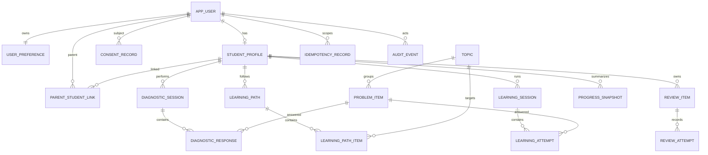

# 수학착착 데이터베이스 설계 v1.0

## 1. Goal Framing

- 사용자: 학생, 연결된 학부모, 교육 콘텐츠 운영자, 개인정보·서비스 운영 책임자
- 변화: 진단부터 학습·힌트·복습·성장 리포트까지 데이터가 한 학생의 권한 경계 안에서 일관되게 이어진다.

## 2. Specification Engineering

완료 상태는 P0 API가 필요로 하는 18개 테이블, 관계·무결성·인덱스·보존 정책, 정방향/역방향 마이그레이션이 명시되고 정적 검증을 통과한 상태다. 운영 DB 실행은 스테이징 자격증명과 백업이 준비된 뒤 별도 수행한다.

## 3. Context Engineering

- DB: PostgreSQL
- 스키마: `mathchakchak`
- ID: 애플리케이션이 생성한 UUID
- 시간: DB에는 `timestamptz` UTC 의미로 저장하고 화면에서 사용자 시간대로 변환
- 다국어: 사용자 선호 locale과 세션 당시 locale만 저장하며 문제·UI 번역 본문은 버전 관리 콘텐츠 계층에서 제공
- 관련 계약: API, 기능, 이벤트, 개인정보, 로케일 계약

## 4. 논리 모델

## 5. 권한과 개인정보

| 데이터 | 학생 | 연결 학부모 | 서비스/운영 |
|---|---|---|---|
| 학생 프로필·설정 | 본인 읽기·수정 | 허용된 요약 읽기 | 최소 권한 |
| 진단·학습 세션 | 본인 생성·읽기 | 상태·요약 읽기 | 처리 서비스 |
| 응답 원자료 | 본인 제출 | 직접 열람 금지 | 채점 서비스 |
| 성장 스냅샷 | 본인 읽기 | 유효한 연결·동의 시 읽기 | 리포트 서비스 |
| 동의 기록 | 주체·보호자 | 관련 기록 | 개인정보 담당 |
| 감사·중복방지 | 직접 접근 없음 | 직접 접근 없음 | 전용 서비스 |

- API는 매 요청에서 역할, 학생 소유권, 활성 학부모 연결, 동의를 검증한다.
- 운영 연결 계정은 테이블 소유자와 분리하며 최소 권한을 적용한다.
- 답안 원문과 문제 원문은 관측 이벤트·감사 metadata에 넣지 않는다.
- 비밀번호·토큰·외부 연락처 원문은 이 스키마에 저장하지 않는다.
- 계정 삭제는 인증 주체를 비활성화하고 법적 보존 대상 이외 학습 데이터를 30일 이내 삭제·비식별화하는 작업으로 처리한다.

## 6. 무결성·동시성

- 세션 완료 상태에는 `completed_at`이 필수다.
- 한 세션의 시도 순번은 유일하다.
- 한 사용자·기능 범위의 `Idempotency-Key`는 유일하며 24시간 후 청소한다.
- 복습 시각은 `timestamptz`로 비교하고 표시만 사용자 시간대로 변환한다.
- 진단 완료→학습 경로 생성, 답안 저장→복습 일정 갱신은 각각 하나의 트랜잭션으로 묶는다.
- 콘텐츠 항목은 학습 기록에서 참조 중이면 물리 삭제하지 않고 `active=false`로 보존한다.

## 7. 인덱스

- 학생별 최근 진단·학습 세션
- 세션별 시도 순서
- 학생별 기한 도래 복습 항목 partial index
- 학생별 최신 성장 스냅샷
- 만료 중복방지 키와 최신 감사 이벤트

## 8. 마이그레이션·복구

1. 스테이징 백업과 복구 가능성을 확인한다.
2. `0001_initial.sql`을 단일 트랜잭션으로 적용한다.
3. 구조·제약·핵심 API smoke test를 실행한다.
4. 실패하면 트랜잭션을 중단한다. 적용 후 되돌림이 필요하면 백업 확인 후 `0001_rollback.sql`을 사용한다.
5. 운영에는 동일 해시의 검증된 migration만 적용한다.

Phase 26의 `0012_data_rights.sql`은 권리 요청과 append-only 상태 이력을 추가한다. 요청자·정보주체·학생 프로필 FK는 `ON DELETE RESTRICT`로 두어 이행 전 요청 증적이 연쇄 삭제되지 않게 하며, `0012_data_rights_rollback.sql`로 로컬 전진→롤백→재적용을 검증한다.

Phase 27의 `0013_privacy_operations.sql`은 요청 배정·증적 해시·승인/반려 결정을 분리 저장한다. 운영 FK는 `ON DELETE RESTRICT`, 상태 전이는 요청 행 잠금과 단일 트랜잭션을 사용하며 실제 이행 전에는 완료 상태를 생성하지 않는다.

## 9. 검증 결과

- 자동 검증: 계약 JSON, 테이블/관계/제약/인덱스, 트랜잭션, rollback 대칭성, 금지 필드 PASS
- PostgreSQL 16 격리 실행: `0001_initial.sql` 적용 PASS
- smoke test: 18개 테이블, locale 허용 목록, idempotency 고유성, 감사 metadata 민감정보 차단 PASS
- `0001_rollback.sql` 적용 후 `mathchakchak` 스키마 0개 확인 PASS
- 실행 근거: `docs/productization/evidence/PHASE_4_POSTGRES_RUNTIME_QA.json`
