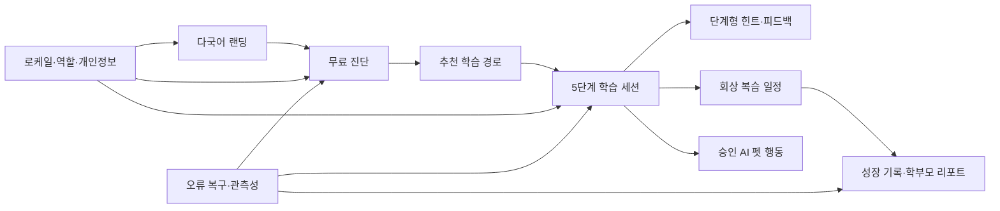

# 수학착착 기능 설계 v1.0

## 1. 설계 목표

P0 요구사항 15개를 client·developer·agent의 독립 모듈로 나누고, 각 기능이 입력·상태·출력·오류·단위 테스트를 갖도록 한다.

## 2. 기능 모듈

### FEAT-I18N-001 로케일 해석기

- 입력: URL locale, 인증 사용자 설정, locale 쿠키, `Accept-Language`
- 출력: 지원 로케일 하나와 결정 근거
- 실패: 미지원 값은 `en`, 누락 키는 fallback+진단 이벤트
- 불변식: IP·정밀 위치를 요구하지 않음, 명시적 URL이 항상 우선

### FEAT-LAND-001 다국어 랜딩

- 입력: locale, 공개 콘텐츠 버전
- 출력: 제품 정의·학습법·FAQ·무료 진단 CTA
- 실패: 번역 로드 실패 시 영어 핵심 UI
- 불변식: 한 화면 한 주 CTA, 검증되지 않은 성과 수치 금지

### FEAT-AUTH-001 역할·권한

- 제품 역할: `STUDENT`, `PARENT`, `ACADEMY_OWNER`, `TEACHER`
- 학생은 자신의 학습 데이터, 학부모는 연결·동의된 학생의 요약, 교사는 학원에서 배정된 학생, 원장은 검증된 기관·교직원 관리 범위만 접근한다.
- 학생 연결·해제, 보호자 동의, 학원 재직·배정과 데이터 삭제는 서버 권한 검사와 감사 이벤트를 거친다.
- 원장·교사는 자기 선언만으로 활성화되지 않고 `PENDING_ACADEMY_VERIFICATION`에서 멈춘다.

### FEAT-AUTH-002 소셜 로그인 생애주기

- 공급자: `GOOGLE`, `NAVER`, `KAKAO`
- 상태: `ANONYMOUS → OAUTH_PENDING → PENDING_ONBOARDING → ACTIVE | PENDING_GUARDIAN | PENDING_ACADEMY_VERIFICATION`
- Google·Kakao는 OIDC ID Token의 서명·issuer·audience·만료·nonce와 PKCE S256을 검증한다. Naver는 state와 공식 사용자 식별 응답을 검증한다.
- 공급자 토큰·이메일·전화번호는 저장하지 않고 공급자 subject, 세션, CSRF, state, nonce는 해시만 저장한다.
- 세션은 12시간 idle, 30일 absolute 만료, HTTPS `__Host-`·`Secure`·`HttpOnly`·`SameSite=Lax`, unsafe method CSRF 검증을 적용한다.
- 로그아웃은 현재 세션 폐기와 append-only 감사 이벤트를 단일 PostgreSQL 트랜잭션으로 처리한다.

### FEAT-DIAG-001 무료 학습 진단

- 상태: `DRAFT → IN_PROGRESS → COMPLETED | ABANDONED`
- 입력: 학년·주제·진단 응답
- 출력: 취약 개념·확신 수준·첫 학습 경로
- 진단 결과는 점수 낙인 대신 시작 위치로 표현한다.

### FEAT-LEARN-001 5단계 학습 세션

- 상태: `UNDERSTAND → CONNECT → REPEAT → RECALL → APPLY → COMPLETED`
- 각 단계는 완료 근거·시도 횟수·힌트 수준을 기록한다.
- 새로고침·일시적 네트워크 오류 후 마지막 확정 단계부터 재개한다.

### FEAT-HINT-001 단계형 힌트

- 수준: 방향 제시 → 첫 단계 단서 → 관련 개념 회상
- 정답·최종 식·정답과 동등한 값을 직접 제공하지 않는다.
- 반복 요청에서도 학생의 기존 시도를 활용하되 입력 원문을 분석 로그에 남기지 않는다.

### FEAT-FEED-001 정답·오답 피드백

- 정답: 무엇을 정확히 했는지 구체적으로 말한 뒤 다음 행동 제시
- 첫 오답: 한 단계 재시도
- 반복 오답: 원인 범위를 좁히고 관련 개념으로 복귀
- 비난·등수·벌점·과도한 연속 보상 금지

### FEAT-REVIEW-001 기억 복습

- 입력: 학습 항목, 회상 성공 여부, 사용자 시간대
- 출력: 다음 복습 시각과 due 목록
- 동일 요청은 중복 일정을 만들지 않는다.
- 시간대 변경과 일광 절약 시간 변경을 안전하게 처리한다.

### FEAT-REPORT-001 성장 기록

- 학생: 오늘의 성취·다음 한 단계
- 학부모: 이해·기억·적용 변화, 취약점, 다음 계획
- 내부 진단 신뢰도와 추정치는 사용자에게 확정 사실로 표현하지 않는다.

### FEAT-PET-001 AI 행동 연동

- Stage 7 이벤트·말풍선과 Stage 8 승인 포즈만 사용한다.
- Gate 5 수동 승인 전 제품 빌드에서는 feature flag 기본값을 `off`로 유지한다.
- 캐릭터 숨김에서도 학습·오류·CTA UI가 유지된다.

### FEAT-A11Y-001 접근성

- 키보드·화면 읽기·포커스·수식 텍스트·44px 터치·색상 외 상태를 공통 컴포넌트 계약으로 제공한다.
- `prefers-reduced-motion`에서 캐릭터 안무를 제거한다.

### FEAT-RWD-001 반응형 UI

- 360/768/1024/1200px 기준으로 랜딩·진단·학습·리포트를 검증한다.
- 핵심 행동은 뷰포트 밖으로 잘리거나 캐릭터에 가려지지 않는다.

### FEAT-PRIV-001 안전·개인정보

- 수집 목적·필수 여부·보존 기간을 필드별로 관리한다.
- 행동·오류 로그에는 학생 답안 원문·이름·연락처·비밀값을 기록하지 않는다.
- 역할·학생 연결을 서버에서 검증한다.

### FEAT-RES-001 오류 복구

- 오류 분류: 네트워크, 시간 초과, 유효성, 충돌, 권한, 내부 오류
- 사용자에게 기술 코드가 아닌 해결 행동을 제공한다.
- 쓰기 요청은 idempotency key로 중복을 방지한다.

### FEAT-OBS-001 관측 가능성

- 이벤트에는 schema version, locale, release, anonymous session, outcome, duration만 허용한다.
- PII denylist 검사와 이벤트 스키마 검증을 빌드에 포함한다.

## 3. 공통 상태 원칙

- 서버가 권한·학습 단계·중복 쓰기의 최종 판단자다.
- 클라이언트 낙관적 UI는 실패 시 이전 확정 상태로 복구한다.
- AI 출력은 도메인 정책과 안전 필터를 통과한 뒤 사용자에게 표시한다.
- locale 변경은 도메인 데이터·진도·답안의 의미를 변경하지 않는다.
