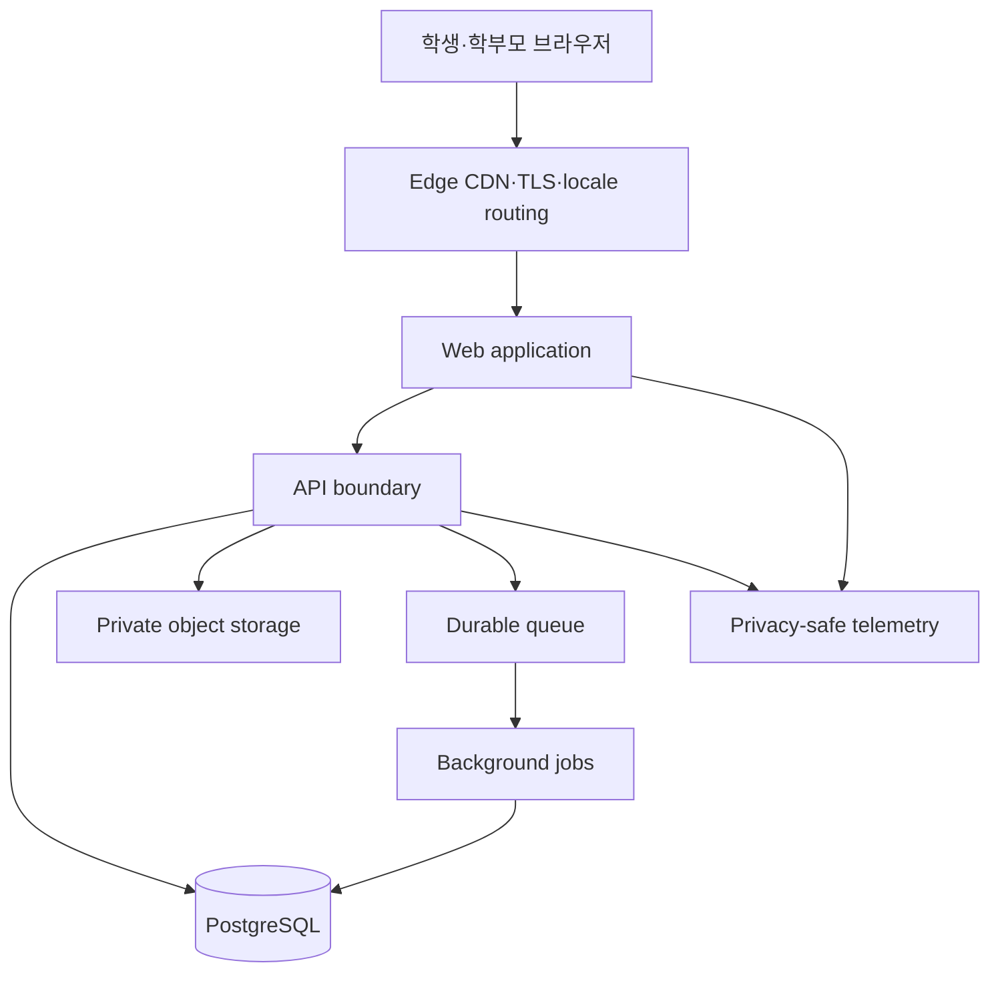

# 수학착착 인프라 설계 v1.0

## 1. 목표

다국어 랜딩·진단·학습·복습·리포트를 안전하게 제공하고, 아동 데이터를 최소 권한으로 보호하며, 스테이징 검증과 되돌릴 수 있는 배포를 지원한다.

## 2. 기술 기준

- 클라이언트·서버: TypeScript 기반 웹 애플리케이션과 API
- 렌더링: 다국어 SEO를 위한 서버 렌더링·정적 생성 혼합
- 데이터베이스: PostgreSQL과 순차 마이그레이션
- 자산: 공개 정적 자산은 CDN, 사용자 생성·비공개 자산은 서명 URL 기반 객체 저장소
- 비동기 작업: 리포트·알림 등 필요 시 내구성 큐 도입
- 테스트: 도메인 단위, API 통합, 실제 브라우저 E2E

구체적인 공급자와 버전은 배포 계정·지역·예산 확인 후 Phase 6~7에서 잠근다. 설계 계약은 공급자에 종속되지 않는다.

## 3. 토폴로지

## 4. 환경

| 환경 | 목적 | 데이터 | 외부 접근 | 배포 |
|---|---|---|---|---|
| local | 개발·단위 테스트 | 합성 데이터 | localhost | 개발자 실행 |
| test | CI·통합 테스트 | 매 실행 격리 | CI 내부 | 임시 |
| staging | 브라우저·접근성·제품 검토 | 비식별 합성 데이터 | 승인 검토자 | main 후보 |
| production | 실제 서비스 | 승인된 운영 데이터 | 공개 | 명시적 승인 |

- 환경별 DB·비밀값·스토리지를 분리한다.
- 운영 데이터를 local/test/staging으로 복제하지 않는다.
- 스테이징은 운영과 같은 locale routing·보안 헤더·마이그레이션 절차를 사용한다.

## 5. 다국어 전달

- `/{locale}/...` 경로를 CDN 캐시 키에 포함한다.
- locale 없는 첫 요청만 해석하여 지원 경로로 리다이렉트한다.
- 사용자의 명시적 언어 선택을 가장 강하게 보존한다.
- IP 위치를 언어 결정 필수 입력으로 사용하지 않는다.
- 번역 번들은 locale·release hash로 캐시하고 누락 시 영어 핵심 번들로 대체한다.

## 6. 보안 경계

- 공개: CDN, 웹, API gateway
- 비공개: DB, 객체 저장소 원본, 큐, 백그라운드 작업자
- TLS와 저장 암호화를 요구한다.
- 인증·진단 쓰기·답안 제출·힌트 요청에 별도 속도 제한을 적용한다.
- 역할·학생 연결·동의 여부는 API에서 검증한다.
- 로그와 텔레메트리는 PII deny-by-default 스키마만 수용한다.
- CSP, HSTS, frame·MIME·referrer 정책을 스테이징부터 검증한다.

## 7. 신뢰성·복구

- 쓰기 API는 idempotency key와 트랜잭션으로 중복을 방지한다.
- 배포는 migration preflight → 애플리케이션 배포 → health check → smoke test 순서다.
- 실패 시 이전 애플리케이션 버전으로 되돌리며 비가역 DB 변경을 같은 릴리스에 포함하지 않는다.
- 운영 초기 목표: 월 가용성 99.9%, RPO 24시간, RTO 4시간.
- 운영 DB는 일일 백업과 지원 가능한 경우 point-in-time recovery를 사용한다.
- 복구 절차는 분기마다 비운영 환경에서 재현한다.

## 8. 관측성

- 요청 ID, release, locale, 기능 ID, outcome, duration을 구조화한다.
- 오류율·p95 지연·배포 상태·큐 지연·DB 연결·번역 fallback을 대시보드화한다.
- 학생 답안 원문·이름·연락처·토큰·쿠키를 수집하지 않는다.
- 경보는 사용자가 실제로 실패하는 증상과 연결하고 중복 경보를 억제한다.

## 9. 비용 통제

- 개발·스테이징은 최소 크기와 자동 휴면/보존 정책을 사용한다.
- 이미지·번역 번들은 CDN에서 장기 캐시한다.
- AI 호출은 기능별 한도·시간 제한·취소·비용 태그를 가진다.
- 월 예산 경보와 비정상 사용량 경보를 운영 전 필수로 설정한다.

## 10. 배포 차단 조건

- Gate 5 승인 없이 AI 펫 feature flag 활성화
- 스테이징 smoke·마이그레이션·롤백 검사 실패
- 비밀값 저장소 외 노출, PII 로그, 공개 DB/스토리지
- 백업·복구 근거 없음
- locale별 핵심 경로 8/8 미검증
